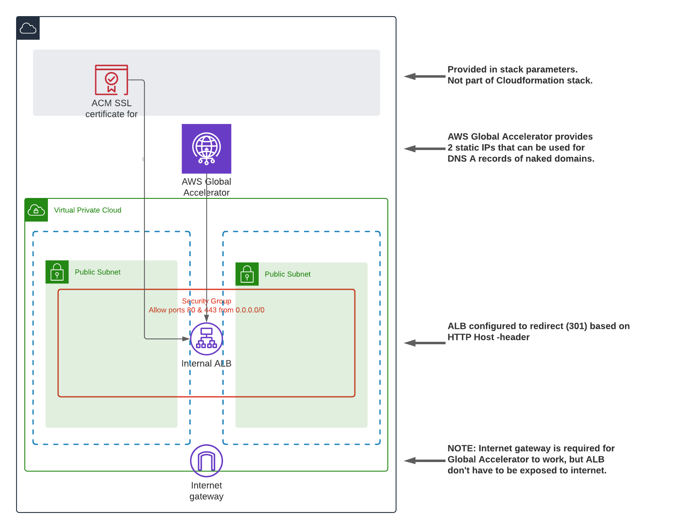

# AWS HTTP 301 Redirector

This is serverless & codeless, as no servers nor code you need to maintain, implementation
of HTTP redirecting service. Advantage of using Application Load Balancer + Global Accelerator
is ability to redirect _naked domains_, e.g. mydomain.fi -> mydomain.com/fi/ 
that is not possible with S3/Cloudfront -solution.

Cloudformation template is generated from Jinja template as this makes it much easier to maintain
a configuration of multiple redirects. To render Cloudformation from Jinja run

> ```jinja -d http301-conf.yaml http301-template.yaml.j2 > http301-template.yaml```

Cloudformation will create all resources except the ACM SSL certificate you must have to support HTTPS.
It is possible to deploy template without ACM certificate, but then only HTTP redirection is enabled.
You can later update the stack with certificate ARN to enable HTTPS.

Global Accelerator provides 2 static anycast IP addresses that can be used for A records of redirected
DNS entries, including naked domains. After the stack has been provisioned, you will find GA DNS name
from stack output and resolve GA addresses.

> ```
> % dig +short ab4520940945edb67.awsglobalaccelerator.com
> 3.33.143.166
> 166.117.29.147
> ```



NOTE: To deploy Global Accelerator for an ALB, load balancer don't have to be ```internet-facing```
nor there needs to be a route to internet (via IGW) from subnets it is deployed, but there must be
IGW attached to VPC. Without IGW attachment, Global Accellerator will refuse to deploy with error message
> ```arn:aws:elasticloadbalancing:REGION:ACCOUNT:loadbalancer/app/ALBID/deadbeefdeadbeef does not have an internet gateway in its VPC vpc-01234567890abcd (Service: AWSGlobalAccelerator; Status Code: 400; Error Code: InvalidArgumentException; Request ID: xxxxxxxx-xxxx-xxxx-xxxx-xxxxxxxx; Proxy: null)```

