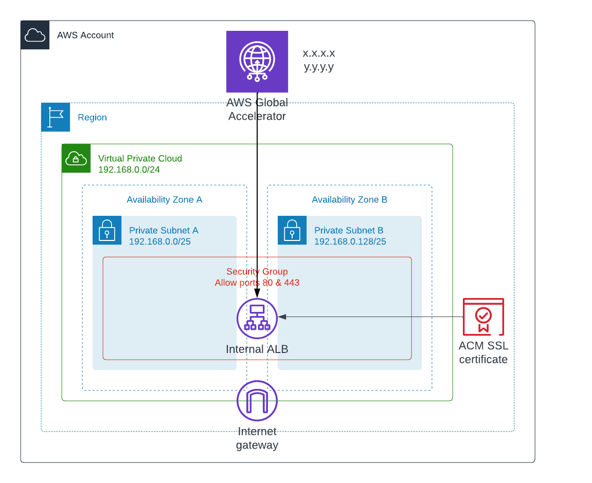

ALB + Global Accelerator for serverless HTTP 301 redirector service, for cases when nakes domain, e.g. carriagereturn.nl is redirected. 



NOTE: To deploy Global Accelerator for an ALB, load balancer don't have to be ```internet-facing```
nor there needs to be a route to internal (via IGW) from subnets it is deployed, but there must be
igw attached to VPC. Without IGW attachment, Global Accellerator will refuse to deploy
with error message
> ```
arn:aws:elasticloadbalancing:REGION:ACCOUNT:loadbalancer/app/ALBID/deadbeefdeadbeef does not have an internet gateway in its VPC vpc-01234567890abcd (Service: AWSGlobalAccelerator; Status Code: 400; Error Code: InvalidArgumentException; Request ID: xxxxxxxx-xxxx-xxxx-xxxx-xxxxxxxx; Proxy: null)
```

